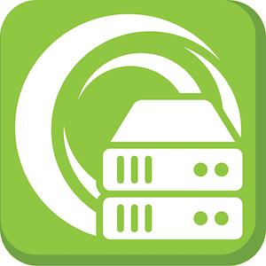

# Welcome To The Cloud

Welcome to the repository of documentation for the [Ortus Solutions' cloud servers](https://www.ortussolutions.com/products/cloud-servers) that you can use to deploy ColdFusion \(CFML\), CommandBox and ContentBox hardened servers to many cloud providers like: AWS, Google Cloud, Azure and Digital Ocean.

