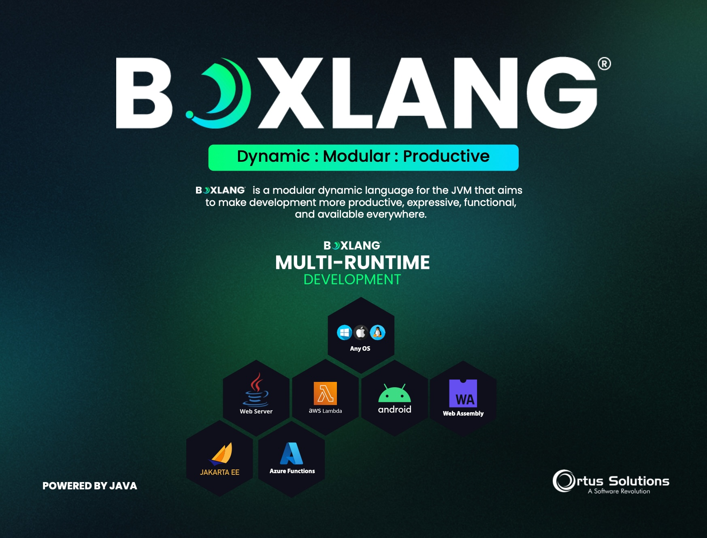

# Welcome To The Cloud

Welcome to the repository of documentation for the [Ortus Solutions' cloud servers](https://www.ortussolutions.com/products/cloud-servers) that you can use to deploy BoxLang / CFML applications to the cloud on the following providers:

* Amazon Web Services (AWS)
* Azure Cloud (`Available now!`)
* Google Cloud (`Available now!`)
* Digital Ocean (`Coming soon`)

<figure><figcaption></figcaption></figure>
