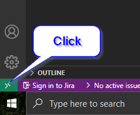

# Connecting via VSCode

You can install the [VSCode Remote Development Extension](https://marketplace.visualstudio.com/items?itemName=ms-vscode-remote.vscode-remote-extensionpack) by visiting the URL or opening VSCode and clicking the extension load button in the IDE and searching for "Remote Development."


### Steps to connect to ec2.

* Click in the green box in the bottom left corner of VSCode. This will open a select box already populated with different Remote Development choices. You want to select Remote-SSH: Open SSH Configuration File...




* If you have not created a configuration file you will have this option.   **Remote-SSH: Add New SSH Host...** Select that instead.
* Your configuration file should look something like this.

```text
Host ColdBoxDemo
    User Administrator
    HostName 34.236.192.135
    IdentityFile ~/.ssh/my-pem-that-i-downloaded-when-creating-ec2.pem
```

