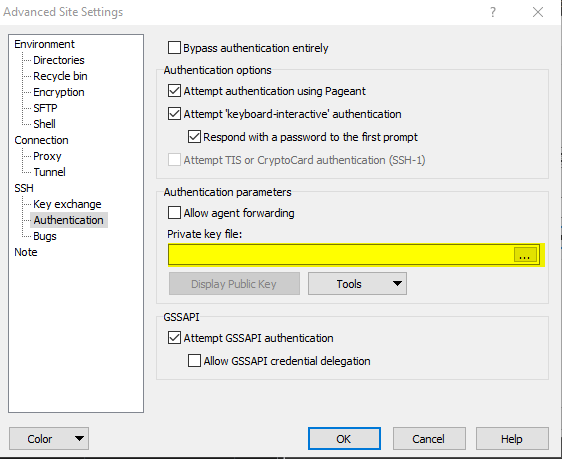

# Connecting via VSCode

You can install the [VSCode Remote Development Extension](https://marketplace.visualstudio.com/items?itemName=ms-vscode-remote.vscode-remote-extensionpack) by visiting the URL or opening VSCode and clicking the extension load button in the IDE and searching for "Remote Development."


### Steps to connect to ec2.

* Click in the green box in the bottom left corner of VSCode. This will open a select box already populated with different Remote Development choices. You want to select Remote-SSH: Open SSH Configuration File...




* If you have not created a configuration file you will have this option.   **Remote-SSH: Add New SSH Host...** Select that instead.
* Your configuration file should look something like this after you fill it out.

```text
Host ColdBoxDemo
    User ubuntu
    HostName 34.236.192.135
    IdentityFile ~/.ssh/my-pem-that-i-downloaded-when-creating-ec2.pem
```

* Having done that it is time to connect to your ec2 instance. Let's click the green button in the lower left corner. The same one we used to open the configuration file.  Let's select "**Remote-SSH: Connect Current Window to Host...**"


* If all works you should have a VSCode screen that looks like the one below. If it does not work you can do what I did, that is to downgrade to VSCode 1.36.1. You can do that with Chocolatey.

```text
choco install vscode --version=1.36.1 -y
```


