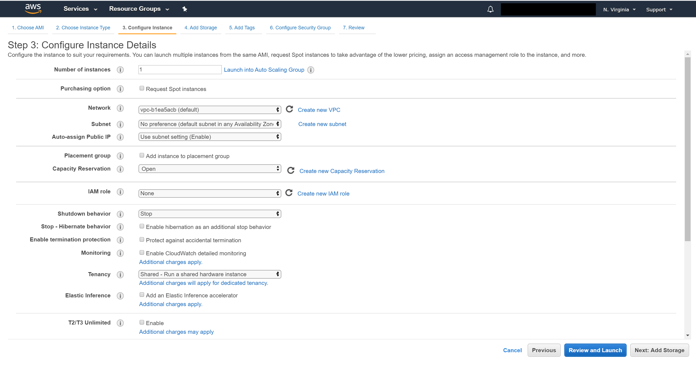
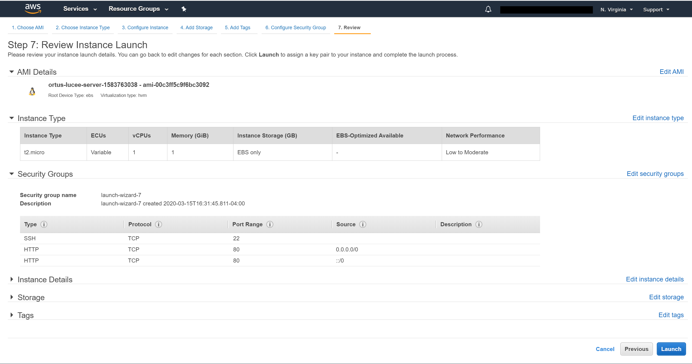
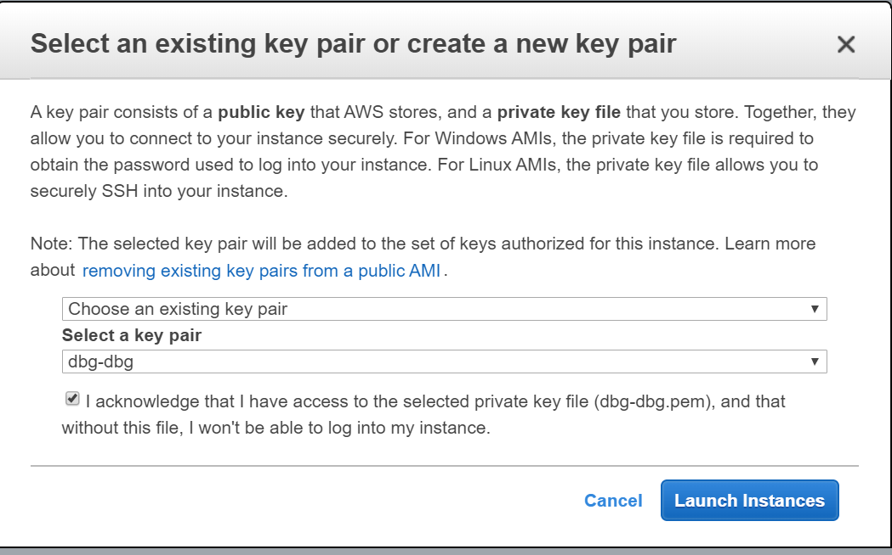

# Lucee + Nginx

This AMI image will create a running Lucee site for you. If you do not want a ColdBox site we will show you how to remove it and have your own site. The first step is to have an AWS account. If you do not have one go to this URL to learn how to create an \[AWS account.\]\( [https://aws.amazon.com/premiumsupport/knowledge-center/create-and-activate-aws-account/](https://aws.amazon.com/premiumsupport/knowledge-center/create-and-activate-aws-account/)\)

* Choose the AWS AMI. Go to this URL and do a search for Ortus at the top of the screen [https://aws.amazon.com/marketplace/](https://aws.amazon.com/marketplace/)
* Click the **continue** to subscribe button
* Click the **accept terms** button
* Next go to this page and click launch new instance [https://console.aws.amazon.com/marketplace/home?\#/subscriptions](https://console.aws.amazon.com/marketplace/home?#/subscriptions)
* This will take you to the "Choose an Instance Type." The default instance and AWS free tier selected is t3.micro. Unless you need more resources keep it at this. Go to the bottom of the screen and select Next:`Configure Instance Details`. 

* You are on the "Configure Instance Details" page and keep the defaults. Go to bottom of the page and click "Next: Add Storage" button.     

* You are now on the "Add Storage" page. Keep the defaults and click the button at the bottom right "Next: Add Tags."

* You are now on the "Add Tags" page. Let's add a tag. Click the add Tag. The y should be Key=Name and Value=Ortus Lucee CFML engine 5.2.9.31 \(Ubuntu Server 18.04 LTS\). Next go to the bottom of the page and click the button that says "Next: Configure Security Group."

* You are on the "Configure Security Group" page. We need to make a couple of changes before leaving this page. First is to go to the source column and select **MyIP** so that ssh will only be enabled for your IP address \(**VERY IMPORTANT**\).
* Next click the "Add Rule" button and under the type column select **http** and leave port 80 selected. Go to the bottom right of the page and select and click the "Review and Launch" button.

* You are on the "Review Launch Instance" page. Review it and once you are okay click the "Launch" bottom on the bottom right of page.

* This opens a module window that is prompting you to suggesting an existing key pair or create a new open. If you do not know what this means I suggest you create a new key pair and put it in a folder that you have access to. If all went well you will see a green colored headline that says "Your instances are now launching."  

* You are on the "Launch Status" page. Go to the bottom right and click the button labeled "View Instances." 

* Select your running instance. This will open some tabs at the bottom of the page. Select the "Description" tab. Look to the right on the description tab and look for "Public DNS \(IPv4\)." To the right of this text is the dns name. Copy that name and paste it in a browser. I should look something like this.
* `ec2-{public_dns}.compute-1.amazonaws.com`
* Paste that URL in a browser and you should see the default ColdBox site.

Enjoy your servers!

