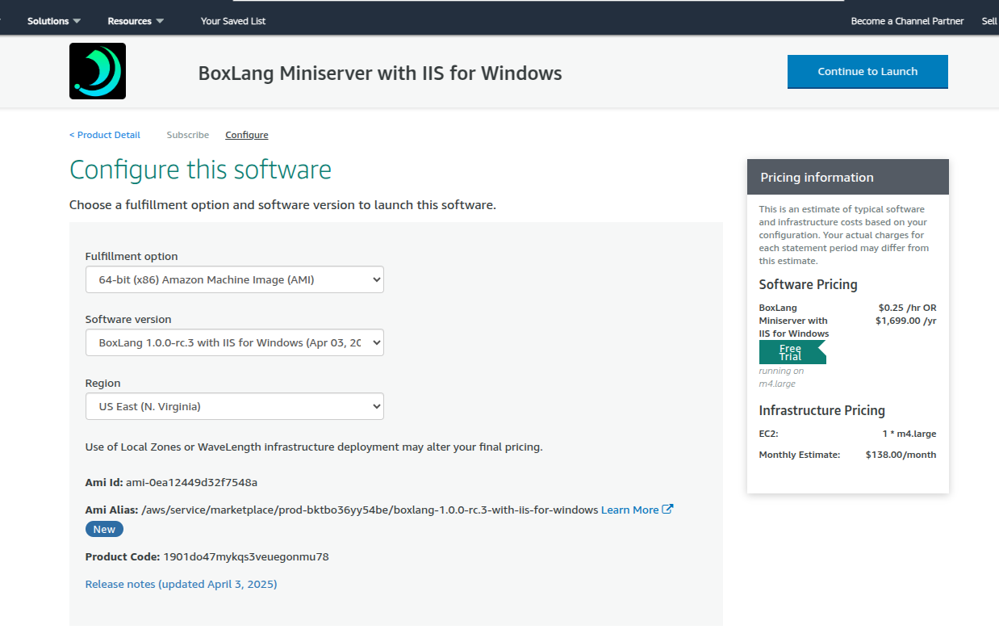
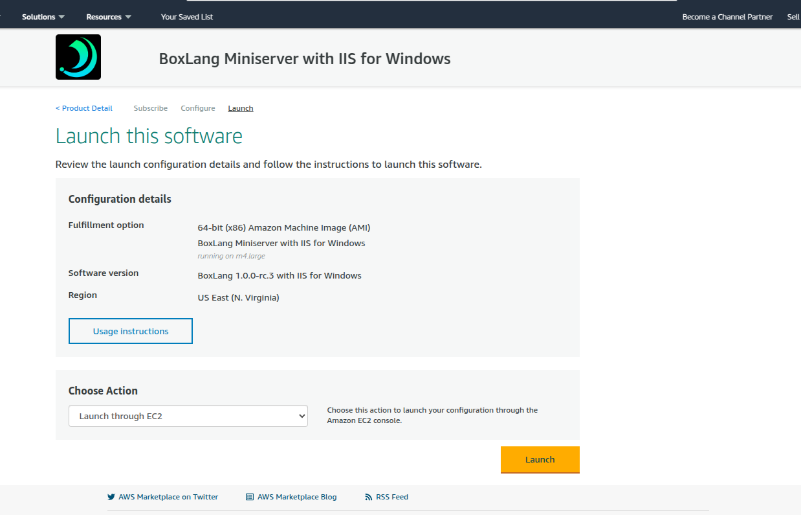
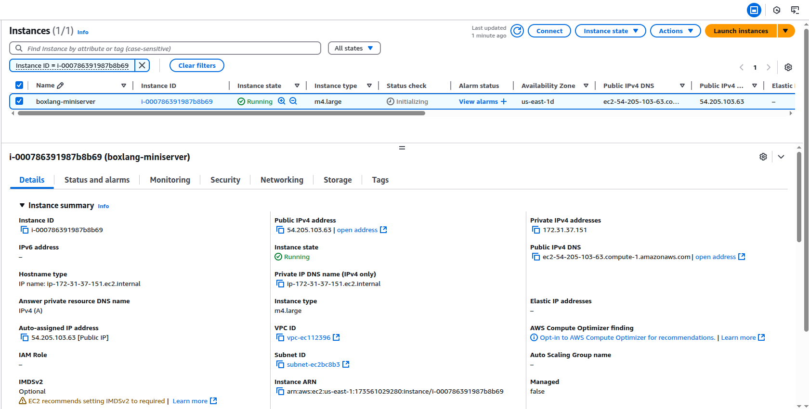
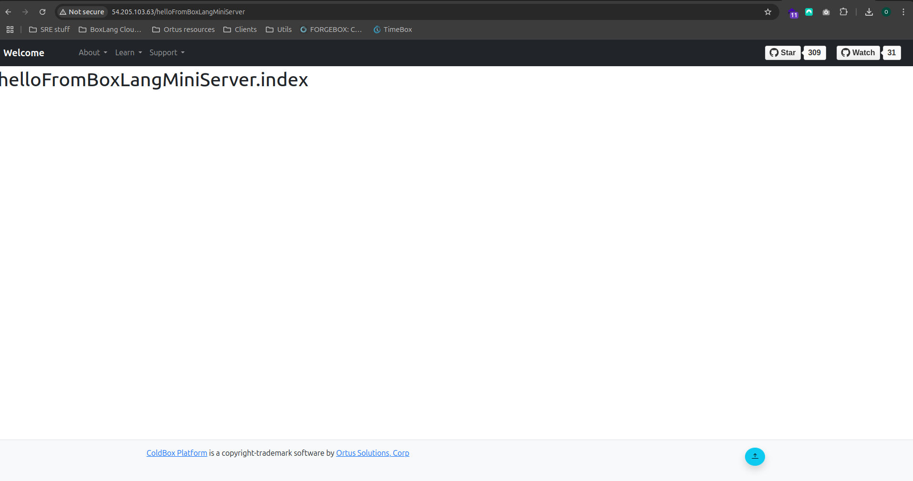

# BoxLang MiniServer

This AMI image will create a running BoxLang server with CFML compatibility module for you. If you do not want a ColdBox site we will show you how to remove it and have your own site. The first step is to have an AWS account. If you do not have one go to this URL to learn how to create an \[AWS account.]\( [https://aws.amazon.com/premiumsupport/knowledge-center/create-and-activate-aws-account/](https://aws.amazon.com/premiumsupport/knowledge-center/create-and-activate-aws-account/))

Choose the **BoxLang MiniServer for Windows** AWS AMI. Go to this URL and do a search for Ortus at the top of the screen [https://aws.amazon.com/marketplace/](https://aws.amazon.com/marketplace/) and look for "Ortus solutions, corp"


Click the **View purchase options** to subscribe button


Configuration options for subscription. In this section you can choose to add options to your contract, if not, You can click on "Continue configuration" button.



You can configure your Ortus Soluction software version or region, if not, just click on "Continue to Launch" button.


In "Launch" section you can choose method to launch, for this case, We're going to use EC2 method.



This will take you to the "Choose an Instance Type." The default instance and AWS free tier selected is `m4.large`. Unless you need more resources keep it at this.\
If You desire or You do not have Key pair, You can generate new ones in "Key pair (login)" section.\
On the "Network settings" section under "Firewall (Security groups)". We need to make a couple of changes. First is to go to the source column and select **My IP** so that SSH and RDP will only be enabled for your IP address (**VERY IMPORTANT**). Next allow **HTTP** and **HTTPS**. You can edit VPC, Subnet and Public IP configuration.\
On "Configure Storage" section. If you want to persist your files, then add a volume. If you do not need to persist the files, keep the defaults.


Select your running instance. This will open some tabs at the bottom of the page. Select the "Description" tab. Look to the right on the description tab and look for "Public DNS (IPv4)." To the right of this text is the DNS name. Copy that name and paste it in a browser. It should look something like this `ec2-{public_dns}.compute-1.amazonaws.com`.



Paste that URL in a browser and you should see the default ColdBox site.


Connect to your EC2 instance using Remote Desktop Protocol (RDP) or SSH to perform the following commands for creating a new handler in ColdBox Sample Application

Change your current directory to `C:\inetpub\wwwroot` and run `box` command to launch CommandBox CLI

```shell
PS C:\Users\administrator> Set-Location C:\inetpub\wwwroot\
PS C:\inetpub\wwwroot> box
```

Now, you can update system dependencies typing `update --system`. create a new handler for testing using `coldbox create handler type=index name=helloFromBoxLangCloudServer` command

```shell
Welcome to CommandBox! 
CommandBox:wwwroot> coldbox create handler type=index name=helloFromBoxLangMiniServer 
 INFO   Created View [C:\inetpub\wwwroot\views\helloFromBoxLangMiniServer/index.cfm] 

 INFO   Created Handler [C:\inetpub\wwwroot\handlers\helloFromBoxLangMiniServer.cfc]

 INFO   Created Integration Spec [C:\inetpub\wwwroot\tests\specs\integration\helloFromBoxLangMiniServerTest.cfc] 

CommandBox:wwwroot>
```



**ENJOY YOUR CLOUD SERVER!**
