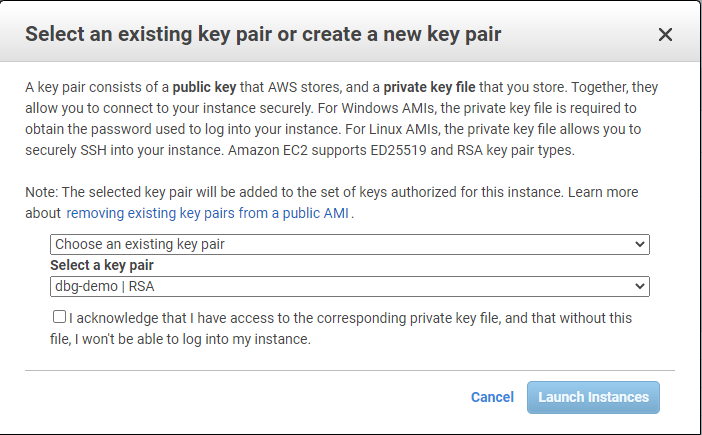

# Contentbox 5

What is Contentbox 5. It is one of the most popular free open source CMS on the market today. This release from Contentbox 4 is a major upgrade for the platform. We can go more indepth about the product at this URL. [https://contentbox.ortusbooks.com/intro/release-history/whats-new-with-5.3.0](https://contentbox.ortusbooks.com/intro/release-history/whats-new-with-5.3.0)\
Part of that upgrade is bringing it to the AWS Cloud as a multi-instance Lucee CommandBox server. It comes with MySQL 5.7 already installed, and CommandBox. This AMI image comes with 2 instances of Lucee 5.3.9 running Contentbox 5.x.

In order to standup your cloud server you will need an AWS account. You can read about how to do that at this link.\
[https://aws.amazon.com/premiumsupport/knowledge-center/create-and-activate-aws-account/](https://aws.amazon.com/premiumsupport/knowledge-center/create-and-activate-aws-account/)

* Head on over to the AWS Marketplace and search for Ortus. [https://aws.amazon.com/marketplace/](https://aws.amazon.com/marketplace/)
* Click the Contentbox 5 continue to subscribe button.
* Accept the terms.
* Click the link below to launch a new instance.\
  [https://console.aws.amazon.com/marketplace/home?#/subscriptions](https://console.aws.amazon.com/marketplace/home?#/subscriptions)
*   Next the choose an instance type comes up. We strongly suggest you choose an instance type with at least 8GB of ram and 2 to 4 CPU's. We have found that the c5.xlarge works really nicely. It has 4 CPU's and 8GB of ram.\

    <figure><figcaption></figcaption></figure>
* You are on the "Configure Instance Details" page keep the defaults. Go to the bottom of the page and click the "Next: Add Storage" button.&#x20;
* The default for storage is 30 GB. I usually bump that up to 60 GB. Remember it is Windows.
*   Click the add Tag. Key=Name and Value=Ortus Lucee Commandbox Multisite (Windows Server 2019) Contentbox 5.0. Next go to the bottom of the page and click the button that says "Next: Configure Security Group." If you will notice I have selected my ip for all of the selected protocols. This is so that we can keep everything private until all is configured then we can open port 80 and 443 up.\

    <figure><figcaption></figcaption></figure>

*   Go to the bottom right of the page and select and click the "Review and Launch" button. This opens a module window that prompts you to an existing key pair or to create a new key pair. If you do not know what this means I suggest you create a new key pair and put it in a folder that you have access to. If all went well you will see a green colored headline that says "Your instances are now launching."\

    <figure><figcaption></figcaption></figure>

*   You are on the "Launch Status" page. Go to the bottom right and click the button labeled "View Instances."&#x20;

    <figure><figcaption></figcaption></figure>

*   Select your running instance. This will open some buttons at the top right of the page. Click the connect button at the top right of the page.&#x20;

    <figure><figcaption></figcaption></figure>
* Select the RDP client tab. This will open a dialog asking you to download your Windows RDP file and decrypt your Windows Administrator password using the pem file you downloaded or the pem file you selected. Click the Get password link.

<figure><figcaption></figcaption></figure>

*   After clicking the Get password link you will be asked to browse to where you have stored your pem file and select it. Then you click decrypt password button and then you copy your password.\

    <figure><figcaption></figcaption></figure>

<figure><figcaption></figcaption></figure>

* Now lets double click your downloaded RDP file. This will open your window to log onto the server. Once on the server let's open Powershell ISE. Then let's copy and paste this code in Powershell. This will setup your Windows host file to run these two Contentbox demo sites for you.  [https://gist.githubusercontent.com/murpg/541bb15dcb802e04feed366305552b11/raw/05d54ccb2ba5bb6641cbcd24868c1a10b7b5e6c5/addToHosts.ps1](https://gist.githubusercontent.com/murpg/541bb15dcb802e04feed366305552b11/raw/05d54ccb2ba5bb6641cbcd24868c1a10b7b5e6c5/addToHosts.ps1)


