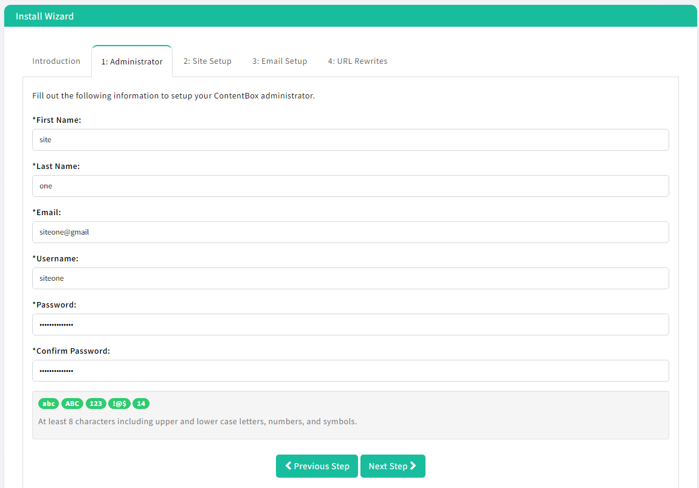
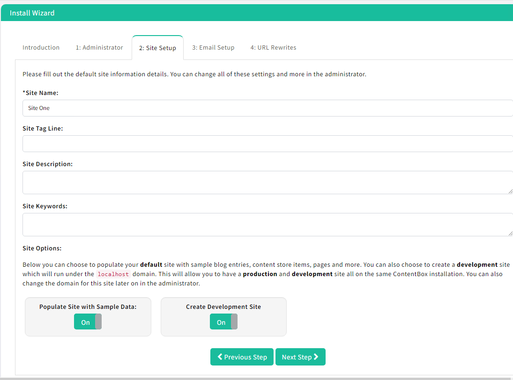
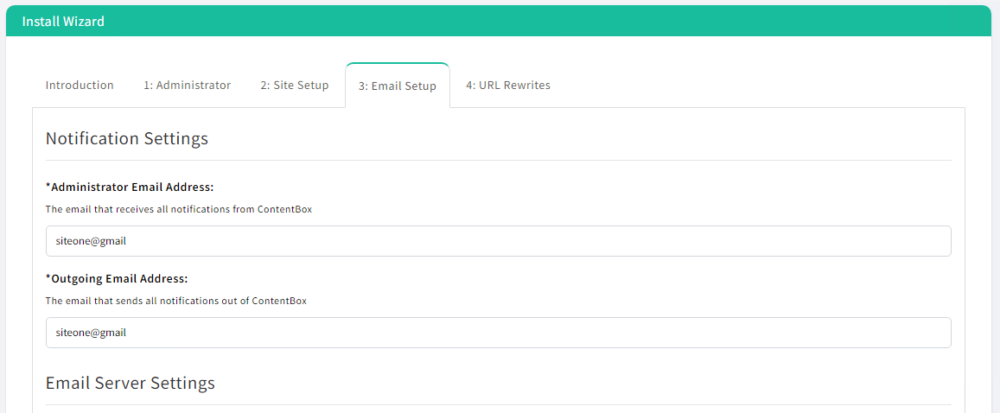
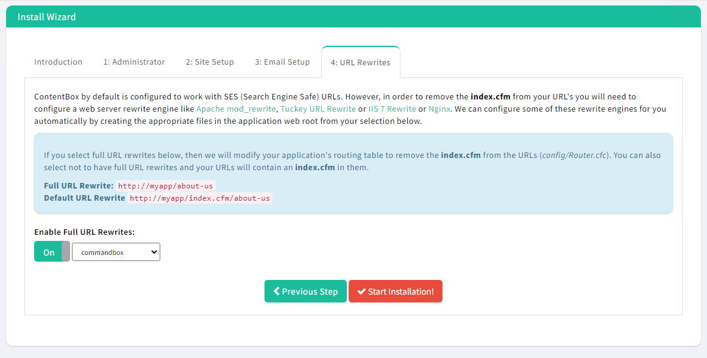

# Running Contentbox

This page will explain the necessary sites to run Contentbox 5 on your AWS Cloud site. Let's take care of some homework first. The GUI part of the Lucee admin is disabled on Contentbox 5. \
\
The sites are at:\
C:\inetpub\wwwroot\site1 | C:\inetpub\wwwroot\site2\
Commandbox is at C:\box\
\
All Lucee admin functionality can be ministered maintained via the Commandbox module CFConfig. Here is a link to get you started with that. [https://cfconfig.ortusbooks.com/](https://cfconfig.ortusbooks.com/)\
To see your Lucee admin settings open a CLI and open a box shell and run.\
cfconfig show

Now let's get Contentbox configured and running on the demo site. If you are an experienced user then create your own site. Here are the steps to get that first site running.

1.  Open a browser and if you have not run this [Powershell code](./) at the bottom of the page you will need to or do it by hand. Paste this URL into your browser and go. http://luceesite1.com

    <figure><figcaption></figcaption></figure>

<figure><figcaption></figcaption></figure>

*   Set the email address

    <figure><figcaption></figcaption></figure>
*   Create the CMS

    <figure><figcaption></figcaption></figure>

