# Lucee + IIS-Boncode

This AMI image will create a running Lucee Windows site for you. If you do not want a ColdBox site we will show you how to remove it and have your own site. The first step is to have an AWS account. If you do not have one go to this URL to learn how to create an \[AWS account.]\( [https://aws.amazon.com/premiumsupport/knowledge-center/create-and-activate-aws-account/](https://aws.amazon.com/premiumsupport/knowledge-center/create-and-activate-aws-account/))

* Choose the **Lucee CFML Server (Windows 2019+Boncode+Tomcat)** AWS AMI. Go to this URL and do a search for Ortus at the top of the screen [https://aws.amazon.com/marketplace/](https://aws.amazon.com/marketplace/) and look for "Ortus solutions, corp"

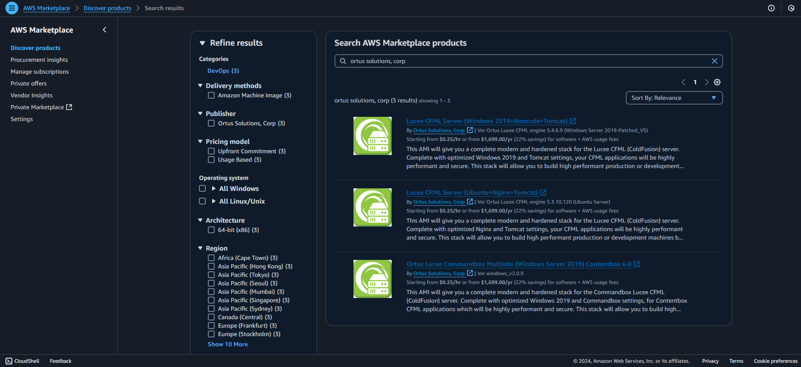

* Click the **View purchase options** to subscribe button

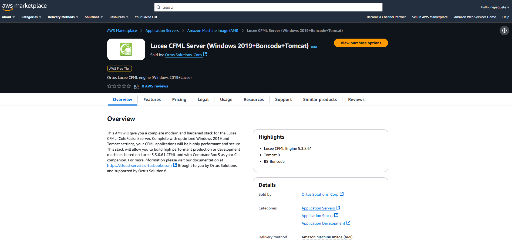

* Click the **accept terms** button

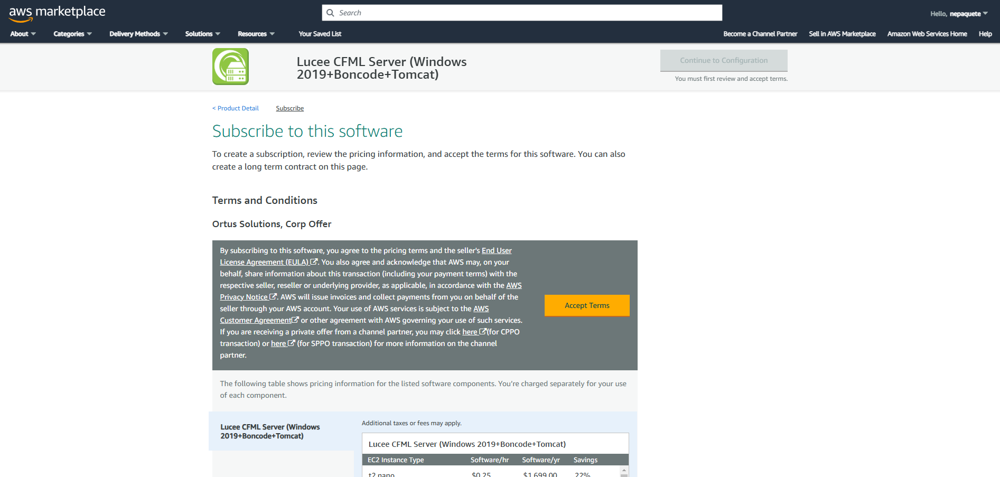

* Configuration options for subscription. In this section you can chose to add options to your contract, if not, You can click on "Continue configuration" button.

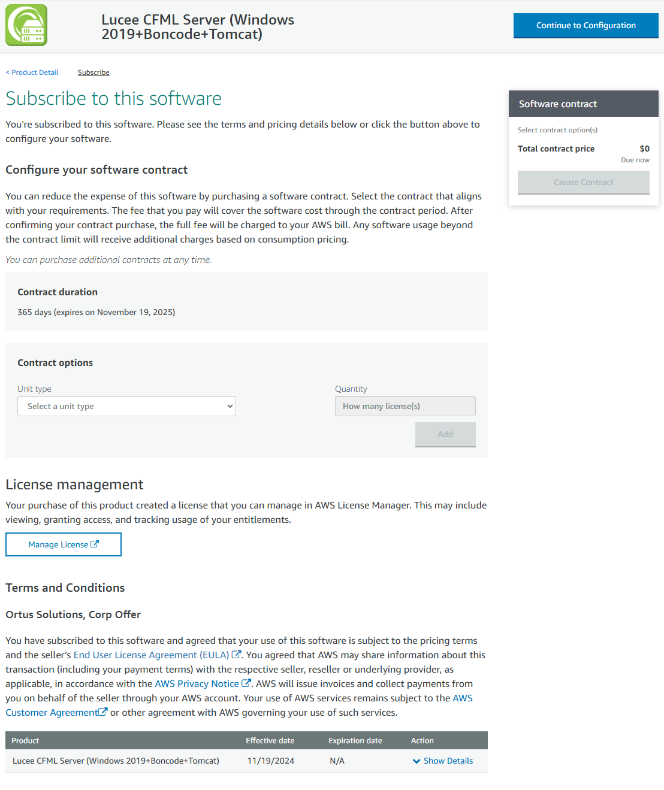

* You can configure your Ortus Soluction software version or region, if not, just click on "Continue to Launch" button.

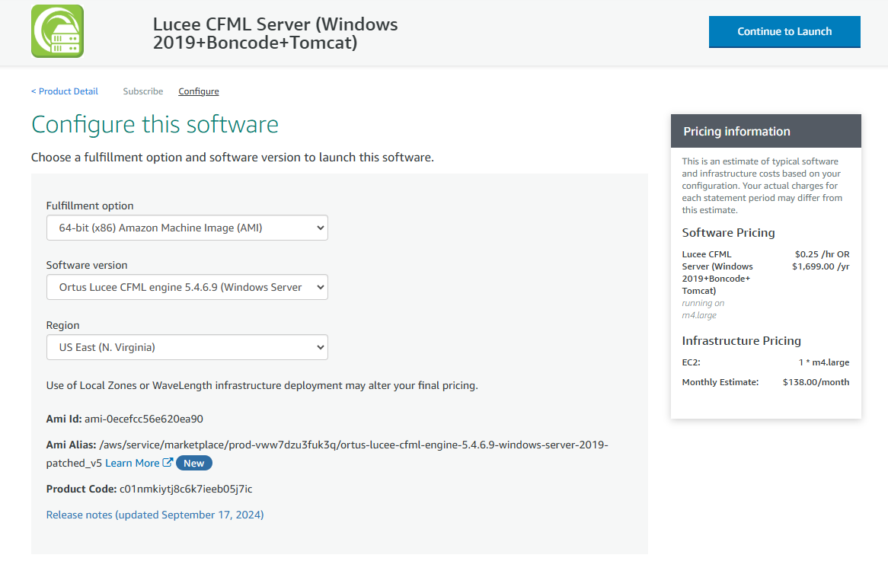

* In "Launch" section you can choso method to launch, for this case, We're going to use EC2 method.

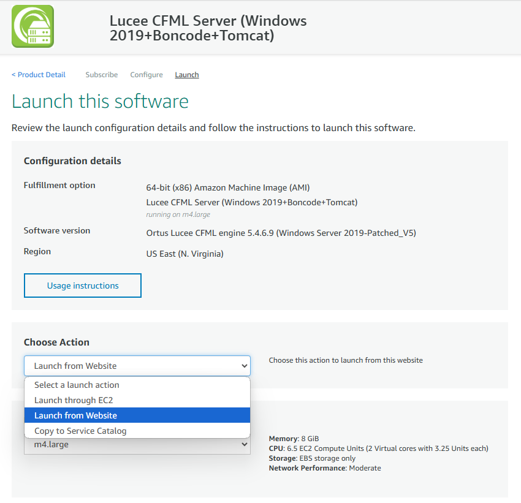

* On the "Name and tags" page. Let's add a tag. Click the add Tag. They should be Key=Name and Value=Ortus Lucee CFML engine 5.3.6.61 (Windows Server 2019) Resource type=Instances.

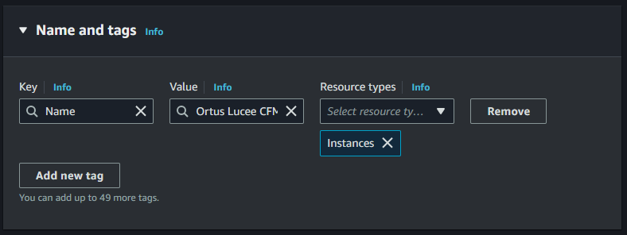

* This will take you to the "Choose an Instance Type." The default instance and AWS free tier selected is `t3.micro`. Unless you need more resources keep it at this. For this guide We're using `t2.medium` size.&#x20;

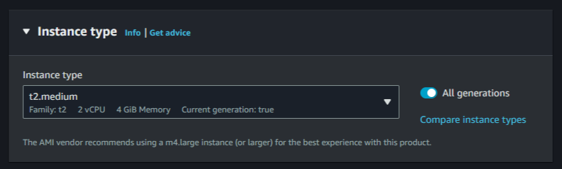

* If You desire or You do not have Key pair, You can generate new ones in "Key pair (login)" section. **SAVE IT IN A SECURE PLACE!**&#x20;

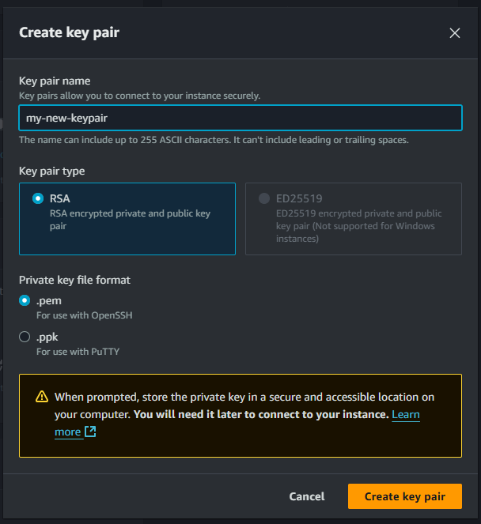

* On the "Network settings" section under "Firewall (Security groups)". We need to make a couple of changes. First is to go to the source column and select **My IP** so that SSH and RDP will only be enabled for your IP address (**VERY IMPORTANT**). Next allow **HTTP** and **HTTPS**. You can edit VPC, Subnet and Public IP configuration.

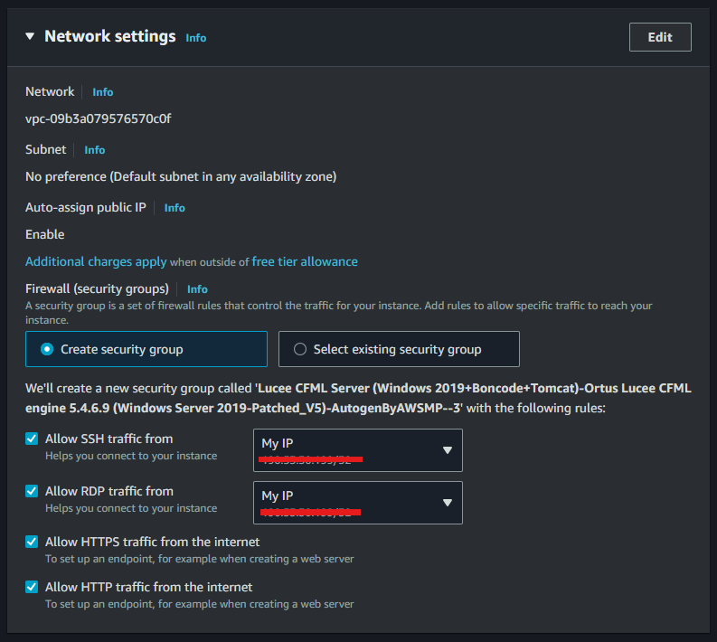

* On "Configure Storage" section. If you want to persist your files, then add a volume. If you do not need to persist the files, keep the defaults.

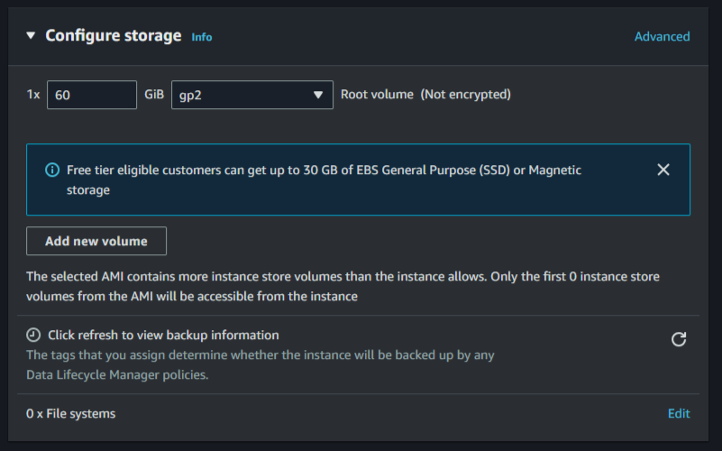

* On "Summary" section you can review general information about your instance, cancel operation, launch instance and also, you can generate AWS CLI commands to deploy EC2 instance with desired configuration.

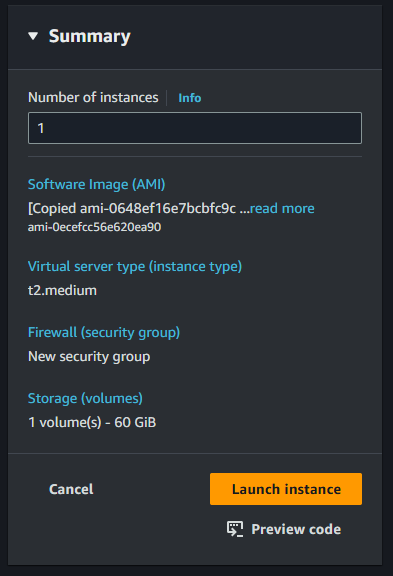

* You are on the "Launch Status" page. Go to the bottom right and click the button labeled "View Instances."&#x20;

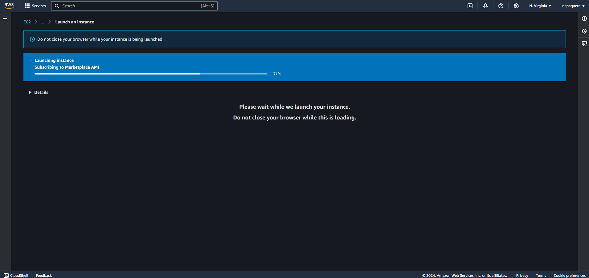

* Select your running instance. This will open some tabs at the bottom of the page. Click on "Connect" at the top of the page. Then click "RDP client". Click on "Get password" button, this will open a dialog asking you to decrypt your Windows RDP administrative password using the pem file you downloaded or the pem file you selected.

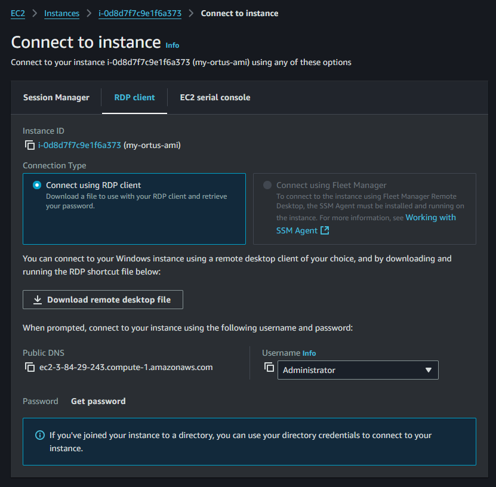

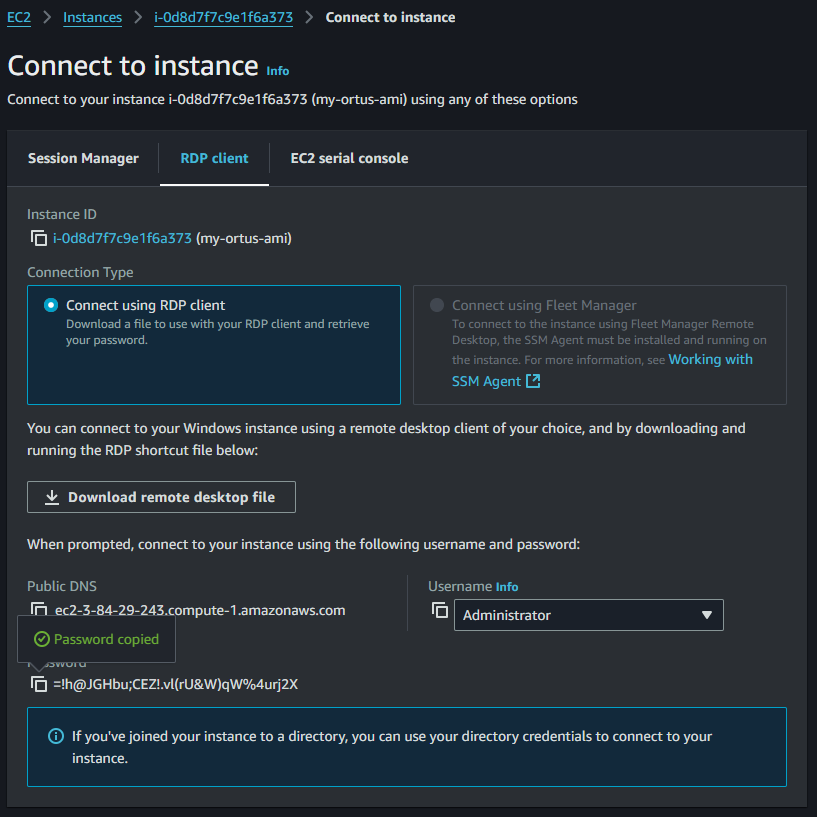

* Download remote desktop file and Log in to manage your instnace.

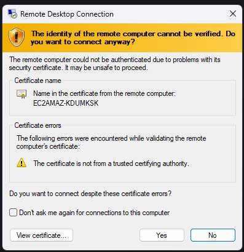

