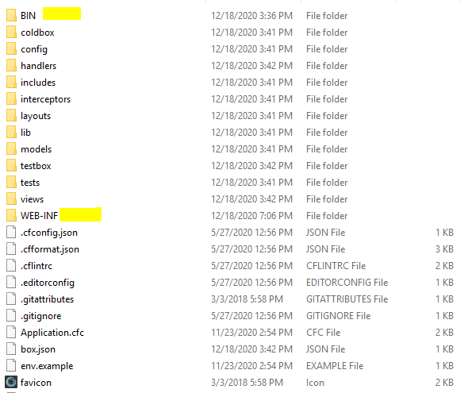

# Managing your web site

## Where is my web site located at?

You have a default ColdBox Template site running at C:\inetpub\wwwroot in the IIS "Default Web Site."  
If you want a different site you can remove all folders except BIN and WEB-INF. But before you do that familiarize yourself with how to access the site and the Lucee administrator. It is fairly simple the site is at   
[http://localhost/](http://localhost/) \(web site\)  
[http://localhost/lucee/admin/server.cfm](http://localhost/lucee/admin/server.cfm) \(Lucee Administrator\)

The Lucee Password is the EC2 Instance ID. Once on the server we strongly urge you to change this password immediately.

### Boncode Connector for IIS.

According to the author of Boncode: "This is the modern method of connecting IIS and Apache Tomcat. Most likely to use a Lucee or JSP driven backend. The BonCode AJP \(Apache JServ Protocol version 1.3\) Connector uses already existing pathways to connect to Apache Tomcat. The AJP implementation is generic and will work to connect IIS with any AJP server such as Jboss, web-methods, Jetty etc. In general it is a preference question how you connect IIS to Tomcat, though, there are several advantages with the BonCode connector vs the old ISAPI connector."

#### Documentation:

[http://www.boncode.net/connector/webdocs/Tomcat\_Connector.htm\#\_Toc38268618](http://www.boncode.net/connector/webdocs/Tomcat_Connector.htm#_Toc38268618)  
[https://github.com/Bilal-S/iis2tomcat](https://github.com/Bilal-S/iis2tomcat)

