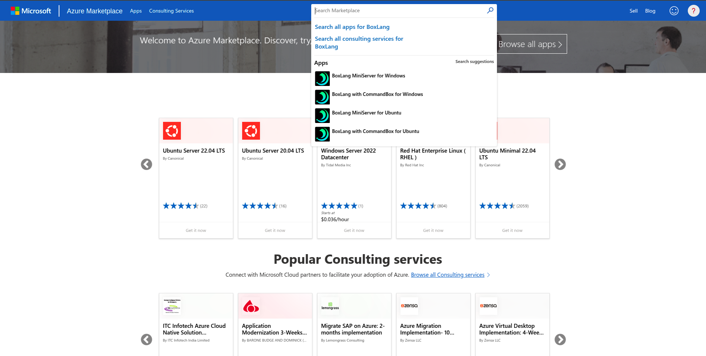

# Ortus Cloud Servers for Microsoft Azure

## Azure Virtual Machine

What is an Azure Virtual Machine? As its name say, It is a simple virtual machine running in Microsoft Azure Cloud. Azure Virtual Machines (Azure VM) is Infrastructure as a Service for computing, this gives you more control over your cloud resources. With this service you can pay as you go or annualy reservation. But if you want more detailed information about this service, you can look at [this](https://learn.microsoft.com/en-us/azure/virtual-machines/overview).

## Setup you Microsoft Azure Subscription

For deploying this Virtual Machine you need a Microsoft Subscription, if not have one follow this [link](https://azure.microsoft.com/en-us/pricing/purchase-options/azure-account) to get 200 USD of credits.

## Azure Microsoft

Azure Microsoft is the place where you can find our Ortus Boxlang Cloud Servers, you can deploy from here and see the differents plans to use them. You are able to deploy a simple tiny server of high performance server, if you already have a Subscription, login with you Microsoft Account and look at our BoxLang Virtual Machines offers at this URL https://azuremarketplace.microsoft.com/en-us/marketplace/apps?page=1&search=BoxLang

