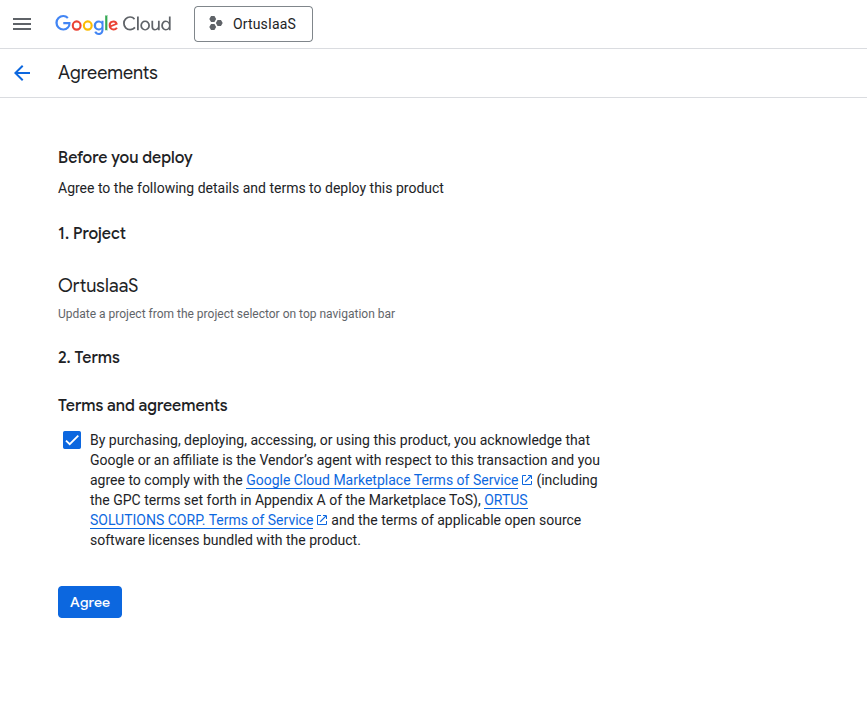
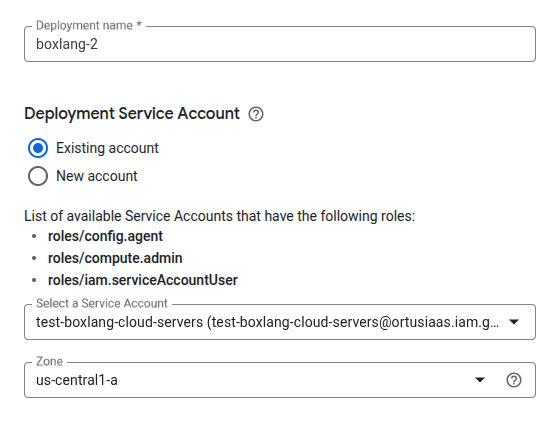
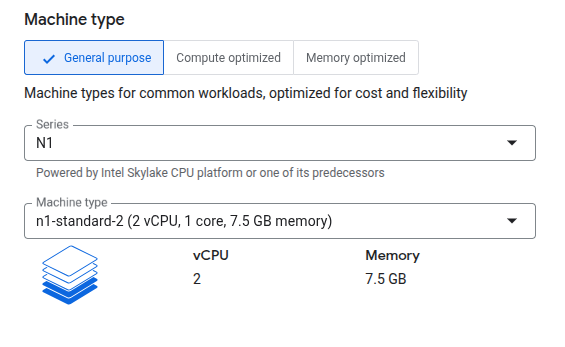
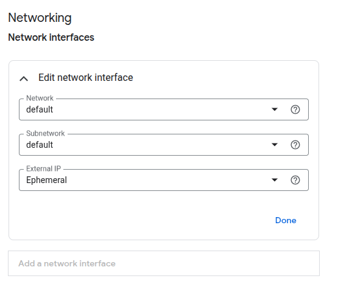
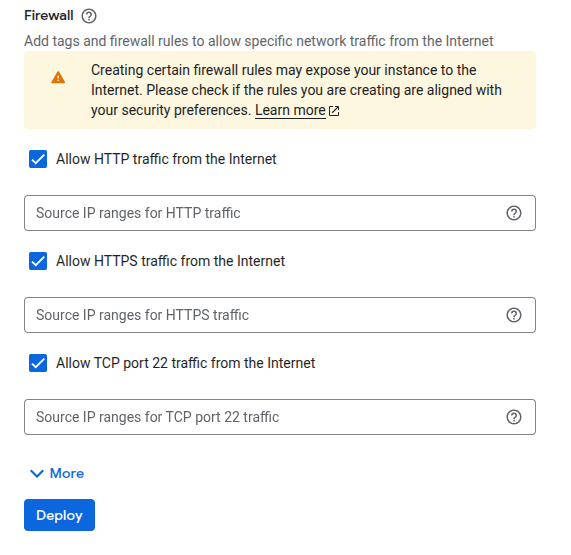
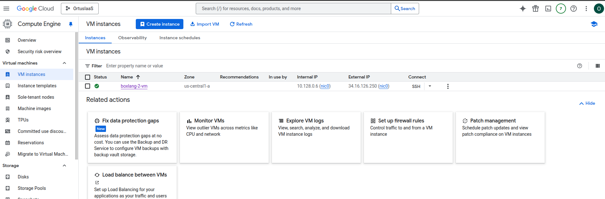
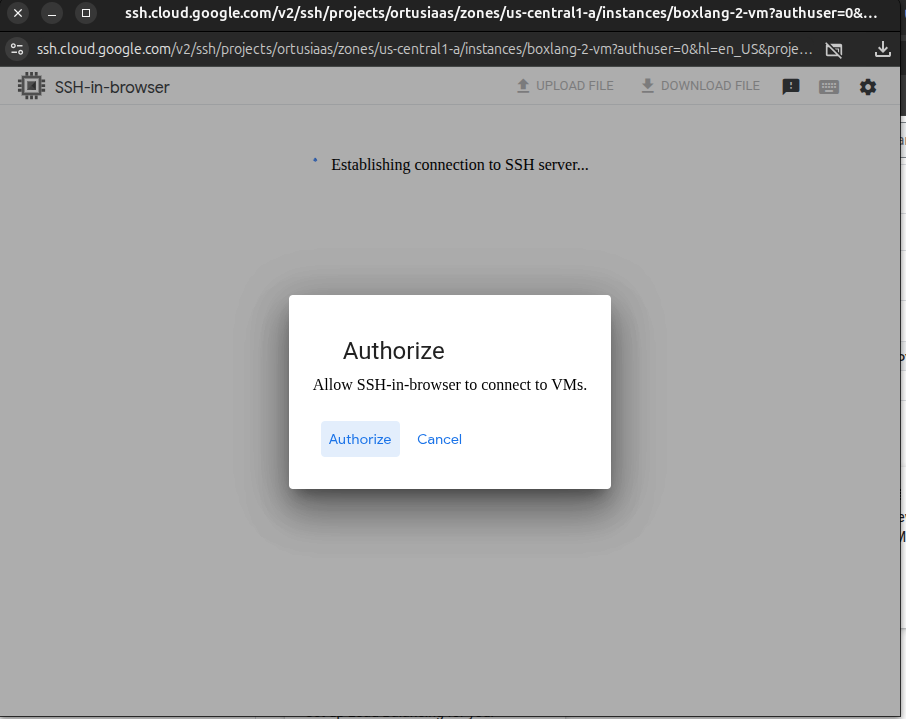
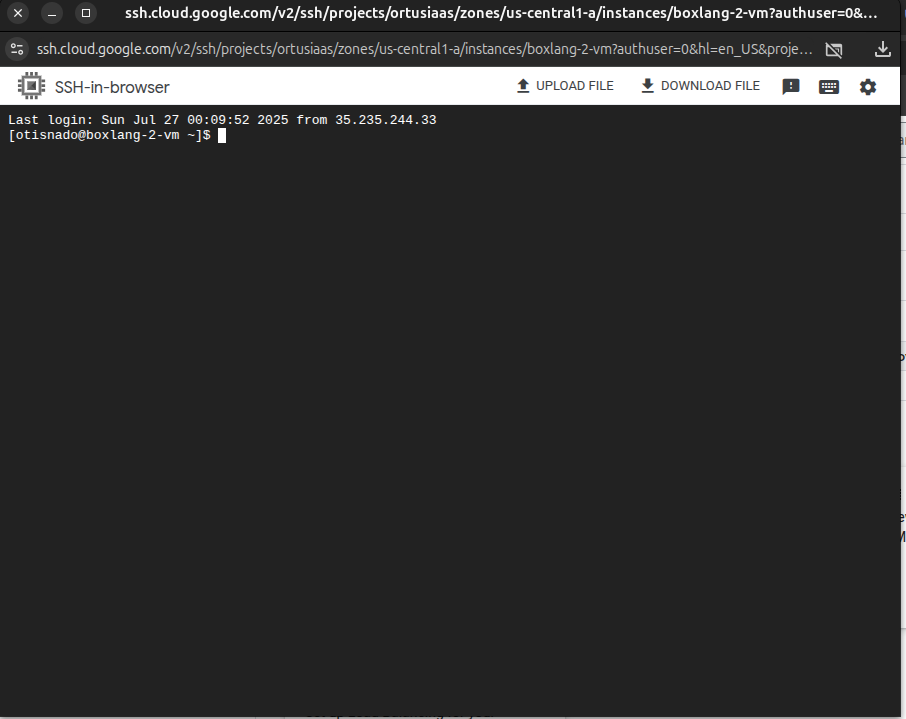

# BoxLang MiniServer on Ubuntu 24.04 LTS

This Virtual Machine create a runnging ColdBox Site using BoxLang with bx-compat-cfml module for you. If you do not want a ColdBox site we will show you how to remove it and have your own site. For deploying this Virtual Machine you need to enable Google Compute API and have a project with billing enabled, if not have one follow this [link](https://cloud.google.com/?hl=en) also, you can get 300 USD of credits.

## Requirements
- To be subscribed to Virtual Machine offer
- Project Editor or Compute Admin roles in Google Cloud project
- A Service Account with `Cloud Infrastructure Manager Agent` `Compute Admin` and `Service Account User` roles

In Google Cloud Marketplace you find this Virtual Machine offer as [**BoxLang with CommandBox for Ubuntu**](https://console.cloud.google.com/marketplace/product/ortussolutions-public/boxlang-miniserver-ubuntu?hl=en&inv=1&invt=Ab30zA) or look for **Ortus Solutions, Corp** to look for out full catalog.

Accept Terms and agreements to subscribe to Virtual Machine offer

  

Deployment config: Set up your deployment with a name, use an existent service account or create a new one for deploying and select the Zone where you want to deploy your virtual machine

  

Machine type: Select Virtual Machine type and size for your Boot disk

  

Networking: Select Network, Subnetwork and External IP configuration for your Virtual Machine

  

Finally select open ports to be available from internet

  

Once your Virtual Machine is deployed, you can view it from Google Compute Engine console. To connect through SSH, click in SSH button a side of your Virtual Machine. You can copy Private and Public IP to connect you at HTTP (80) port.

  

When connect through SSH using web console a new window is opened asking for authorize to load your Google Cloud user's SSH keys into virtual machine

|Asking for Authorization|SSH Connected Window|
|---|---|
|||

If you want to load your own SSH keys or connect to your Virtual Machone with differents SSH clients, follow this [link](https://cloud.google.com/compute/docs/connect/standard-ssh) for more information about it.
