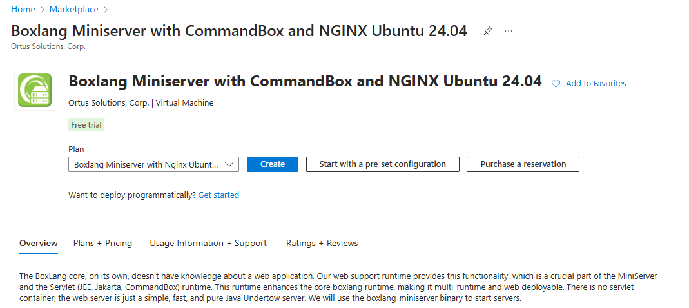
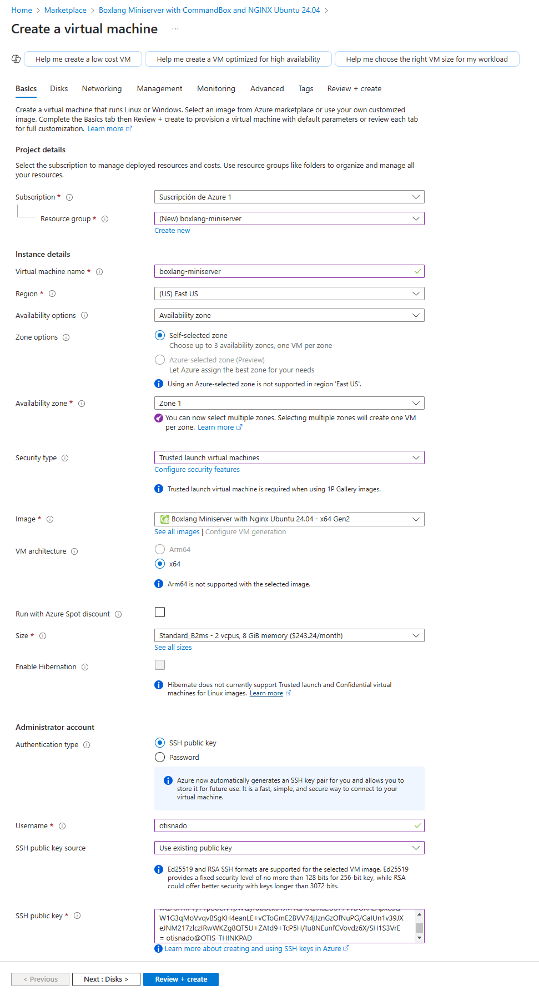
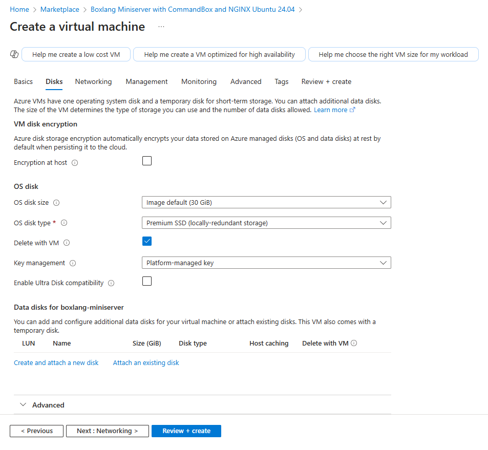
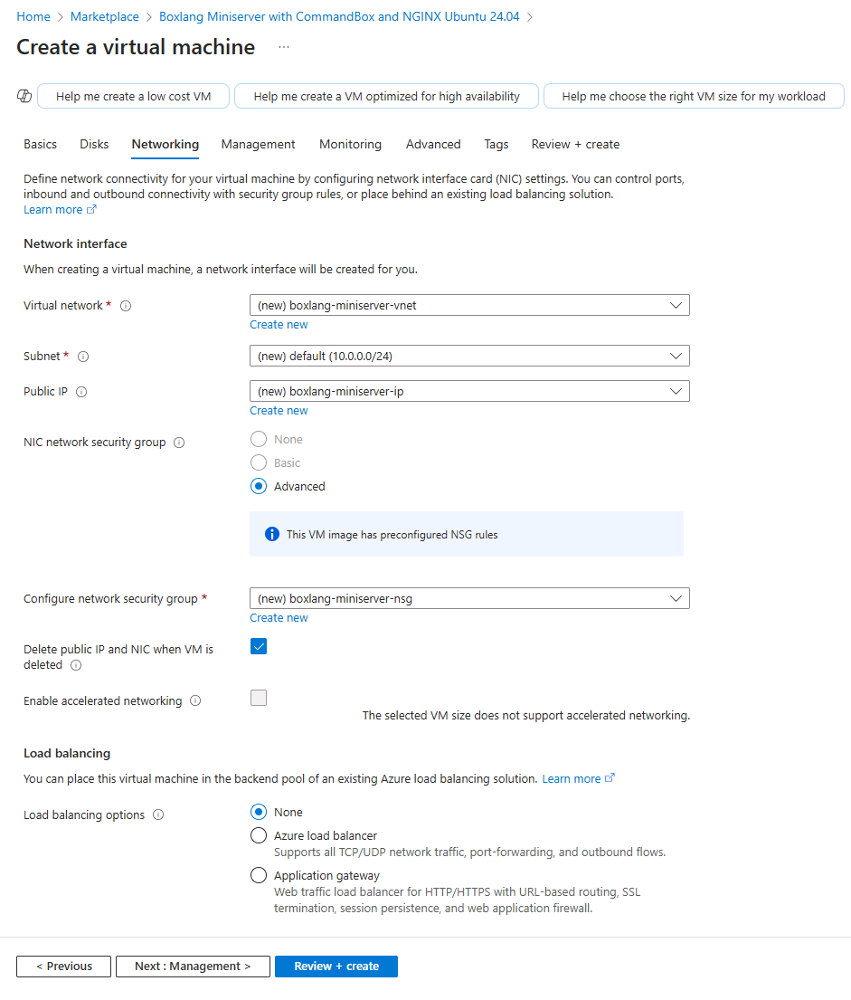
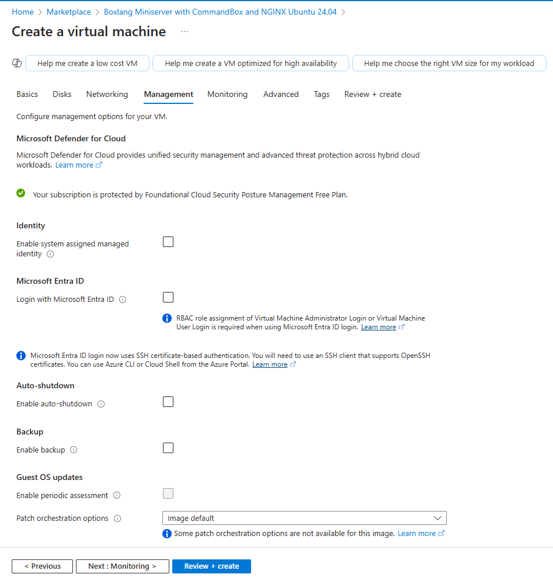
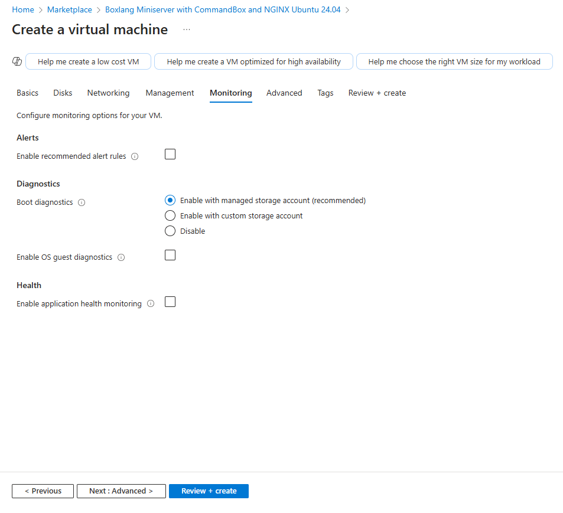
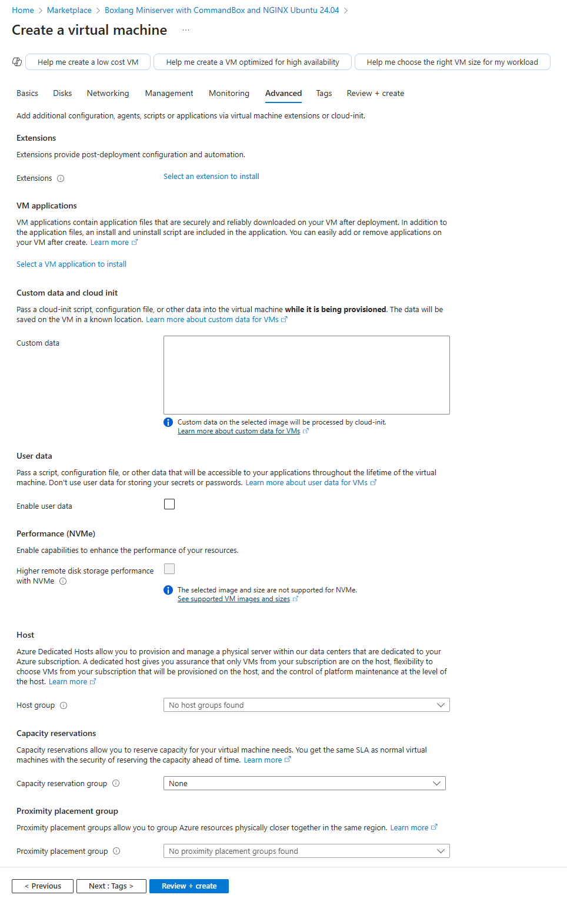
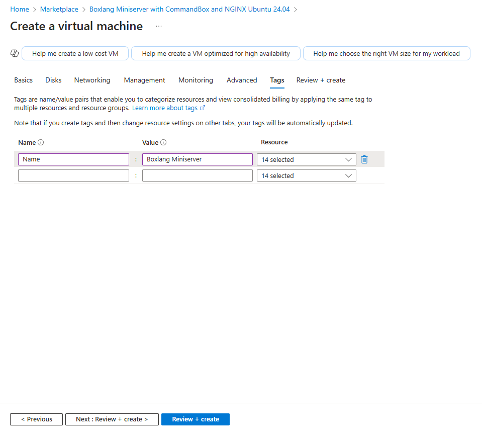
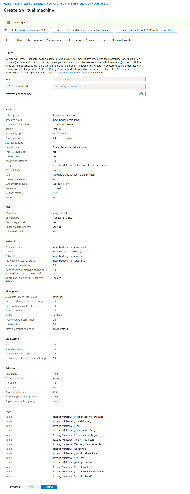

# CommandBox + BoxLang

This Azure Virtual Machine create a runnging ColdBox Site using BoxLang with bx-compat-cfml module for you. If you do not want a ColdBox site we will show you how to remove it and have your own site. For deploying this Virtual Machine you need a Microsoft Subscription, if not have one follow this [link](https://azure.microsoft.com/en-us/pricing/purchase-options/azure-account) to get 200 USD of credits.

In Azure Marketplace you find this Virtual Machine offer as [**BoxLang Miniserver with CommandBox and NGINX Ubuntu 24.04**](https://azuremarketplace.microsoft.com/en-us/marketplace/apps/ortus.boxlang-miniserver-ubuntu?tab=Overview) or look for **Ortus Solutions, Corp** to look for out full catalog.

## Deploy BoxLang Miniserver with CommandBox and NGINX Ubuntu 24.04 from Azure Marketplace

* In the overview product click on **create** button to start deployment proccess

* In **Basics** tab select your Azure Subscription, resource group and region where Virtual Machine reside. Also, you set here Name, Availability zone, Size, Username and your desired method to login of your Virtual Machine.

* **Disks** tab let you set up additional managed disk for your Virtual Machine, We recommend to add one additional data disk to store your data. If you change a different size for disk read [How expand your partition size](https://learn.microsoft.com/en-us/azure/virtual-machines/windows/expand-disks) documentation.

* In **Networking** you set up Virtual Network, Subnet, Public IP and Network Security (this can be default or make a custom by you). If Virtual Machine size selected is compatible you can enable Accelerated networking. Also if you plan to deploy this Virtual Machine behind a Load Balancer you can config that from here.

* **Management** tab let you configure Identity for your Virtual Machine, Auto-shutdown, backups and Guest OS update. Currently we are working to support Microsoft Entra ID authentication, but if want to enable out of the box, follow this [link](https://learn.microsoft.com/en-us/entra/identity/devices/howto-vm-sign-in-azure-ad-linux).

* In **Monitoring** tab you can Alerts, Boot diagnostics and Health monitoring for your Virtual Machine.

* In **Adavance** you can add Extensions, Application or Custom scripts with cloud-init and configuration related to where is located physically your Virtual Machine.

* **Tags** tab let you tagging your virtual machine and dependent resources.

* **Review + create** tab let you see all your configurations and alerts you if any of them need review or change, if not, click on **create** to deploy your **BoxLang with CommandBox Ubuntu 24.04** Virtual Machine.

